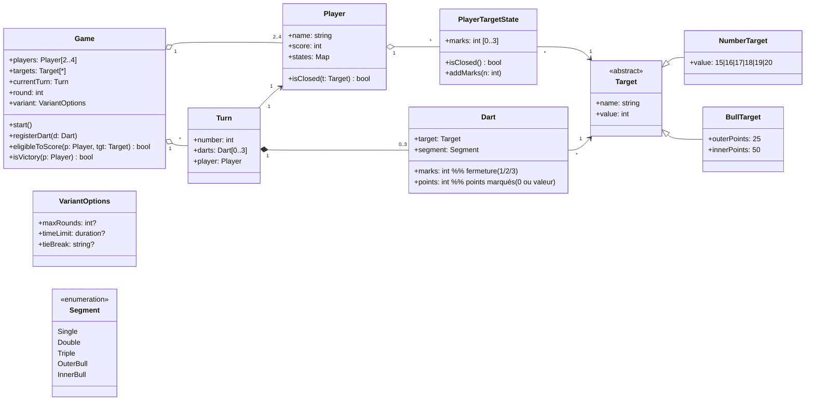

```mermaid
classDiagram
    direction LR

    class Game {
        +players: Player[2..4]
        +targets: Target[*]
        +currentTurn: Turn
        +round: int
        +variant: VariantOptions
        +start()
        +registerDart(d: Dart)
        +eligibleToScore(p: Player, tgt: Target) bool
        +isVictory(p: Player) bool
    }

    class Player {
        +name: string
        +score: int
        +states: Map<Target, PlayerTargetState>
        +isClosed(t: Target) bool
    }

    class Turn {
        +number: int
        +darts: Dart[0..3]
        +player: Player
    }

    class Dart {
        +target: Target
        +segment: Segment
        +marks: int      %% fermeture (1/2/3)
        +points: int     %% points marqués (0 ou valeur)
    }

    class Target {
        <<abstract>>
        +name: string
        +value: int
    }

    class NumberTarget {
        +value: 15|16|17|18|19|20
    }

    class BullTarget {
        +outerPoints: 25
        +innerPoints: 50
    }

    class PlayerTargetState {
        +marks: int [0..3]
        +isClosed() bool
        +addMarks(n: int)
    }

    class VariantOptions {
        +maxRounds: int?
        +timeLimit: duration?
        +tieBreak: string?
    }

    class Segment {
        <<enumeration>>
        Single
        Double
        Triple
        OuterBull
        InnerBull
    }

Game "1" o-- "2..4" Player
Game "1" o-- "*" Turn
Turn "1" --> "1" Player
Turn "1" *-- "0..3" Dart
Dart "*" --> "1" Target
Player "1" o-- "*" PlayerTargetState
PlayerTargetState "*" --> "1" Target
Target <|-- NumberTarget
Target <|-- BullTarget


```