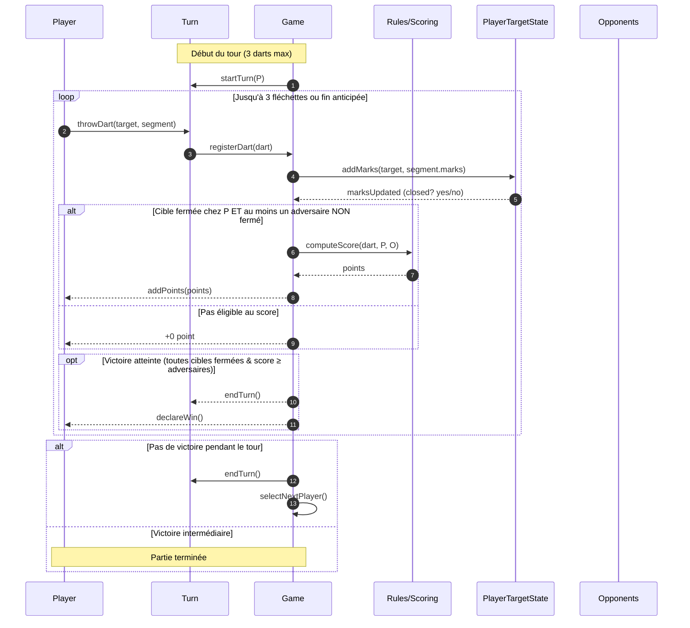

```mermaid

sequenceDiagram
autonumber
participant P as Player
participant T as Turn
participant G as Game
participant R as Rules/Scoring
participant S as PlayerTargetState
participant O as Opponents

Note over G,T: Début du tour (3 darts max)
G->>T: startTurn(P)

loop Jusqu'à 3 fléchettes ou fin anticipée
  P->>T: throwDart(target, segment)
  T->>G: registerDart(dart)
  G->>S: addMarks(target, segment.marks)
  S-->>G: marksUpdated (closed? yes/no)

  alt Cible fermée chez P ET au moins un adversaire NON fermé
    G->>R: computeScore(dart, P, O)
    R-->>G: points
    G-->>P: addPoints(points)
  else Pas éligible au score
    G-->>P: +0 point
  end

  opt Victoire atteinte (toutes cibles fermées & score ≥ adversaires)
    G-->>T: endTurn()
    G-->>P: declareWin()
  end
end

alt Pas de victoire pendant le tour
  G->>T: endTurn()
  G->>G: selectNextPlayer()
else Victoire intermédiaire
  Note over G,P: Partie terminée
end


```