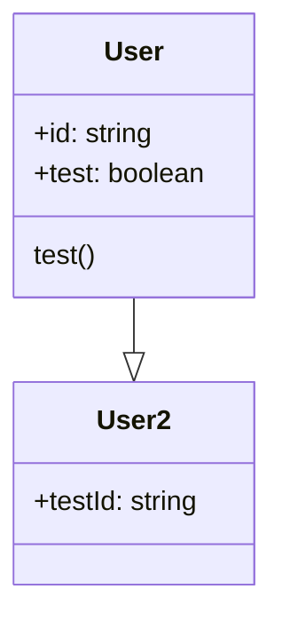
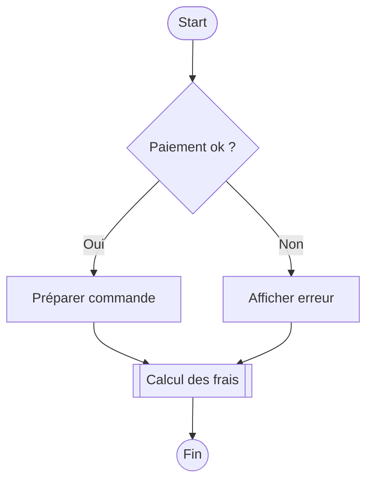
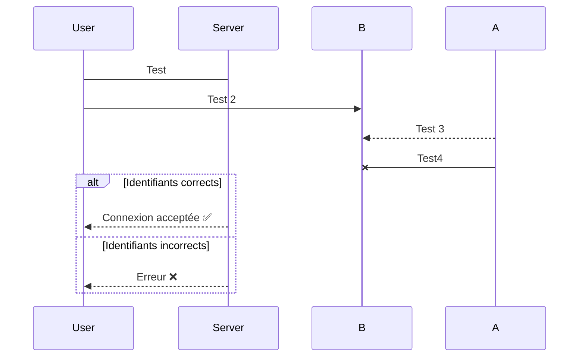

```mermaid
classDiagram 
    d
    class User {
        +id: string
        +test: boolean
        test()
    }

    class User2 {
        +testId: string
    }
    
    User --|> User2
```

```mermaid
flowchart TD
%% 🟢 Début
    A([Start]) --> B{Paiement ok ?}
    B -->|Oui| C[Préparer commande]
    B -->|Non| D[Afficher erreur]
    C --> E[[Calcul des frais]]
    D --> E
    E --> F((Fin))


```

```mermaid
  sequenceDiagram
     
participant U as User
participant S as Server

U -> S: Test
U ->>B: Test 2
A-->>B: Test 3
A-xB: Test4

    alt Identifiants corrects
        S-->>U: Connexion acceptée ✅
    else Identifiants incorrects
        S-->>U: Erreur ❌
    end


```