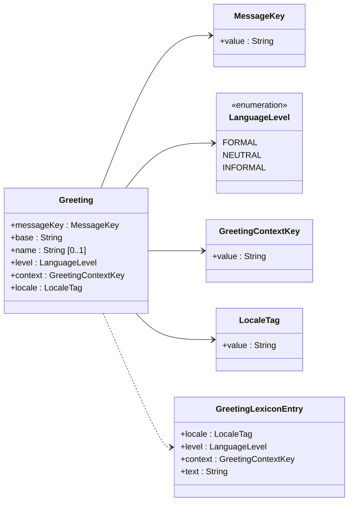

```mermaid
classDiagram
    direction LR

    class LocaleTag {
        +value : String
    }

    class GreetingContextKey {
        +value : String
    }

    class LanguageLevel {
        <<enumeration>>
        FORMAL
        NEUTRAL
        INFORMAL
    }

    class GreetingLexiconEntry {
        +locale  : LocaleTag
        +level   : LanguageLevel
        +context : GreetingContextKey
        +text    : String
    }

    class MessageKey {
        +value : String
    }

    class Greeting {
        +messageKey : MessageKey
        +base       : String
        +name       : String [0..1]
        +level      : LanguageLevel
        +context    : GreetingContextKey
        +locale     : LocaleTag
    }

    Greeting --> MessageKey
    Greeting --> LanguageLevel
    Greeting --> GreetingContextKey
    Greeting --> LocaleTag
    Greeting ..> GreetingLexiconEntry


```